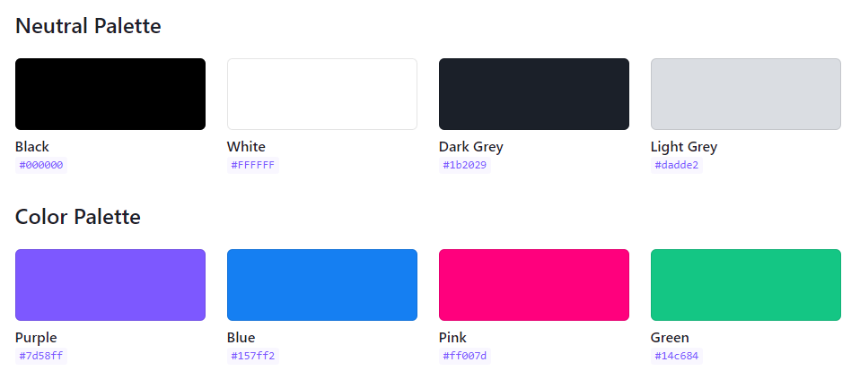
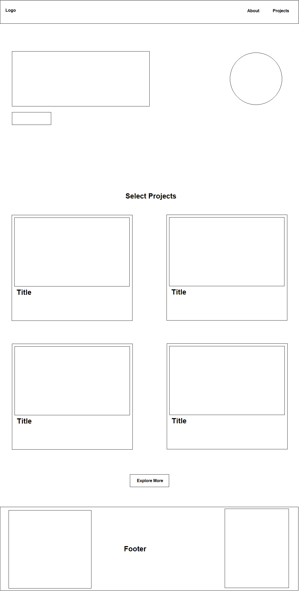
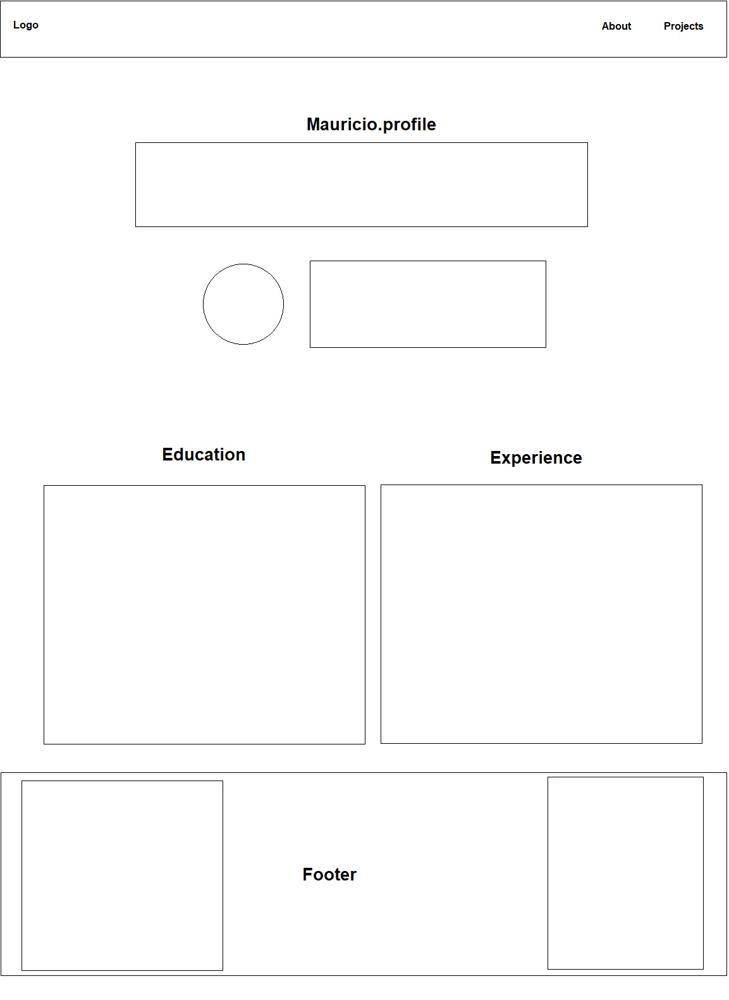

# Mauricio Portafolio

This is the source code for my personal website.

    
    
    
    

## Table of Contents

- [Design](#design)
  - [Fonts](#fonts)
  - [Color Scheme](#color-scheme)
- [Wireframes](#wireframes)
- [Built With](#built-with)

---

## Design

### Fonts

[Fire Code](https://fonts.google.com/specimen/Fira+Code) - headings and code text

[Nunito](https://fonts.google.com/specimen/Nunito) - normal text

### Color Scheme

---

## Wireframes

- Home

- About

## Built With

- [HTML5](https://www.w3schools.com/html/)
- [CSS3](https://www.w3schools.com/css/)
- [JavaScript](https://www.w3schools.com/js/DEFAULT.asp)
- [Flaticon](https://www.flaticon.com/) and [FontAwesome](https://fontawesome.com/v5.15/icons?d=gallery&p=1) for the icons

---

### License

Copyright &copy; 2022 mau-io. All rights reserved.